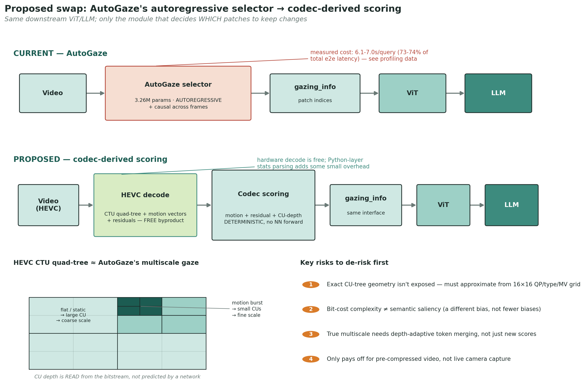
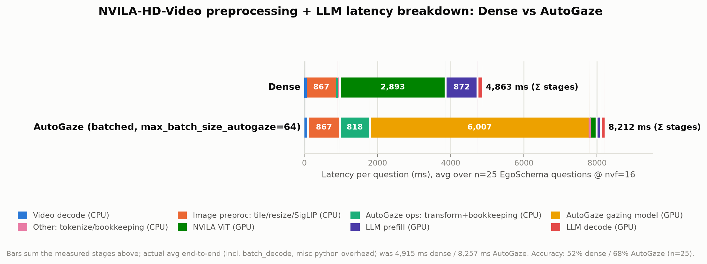
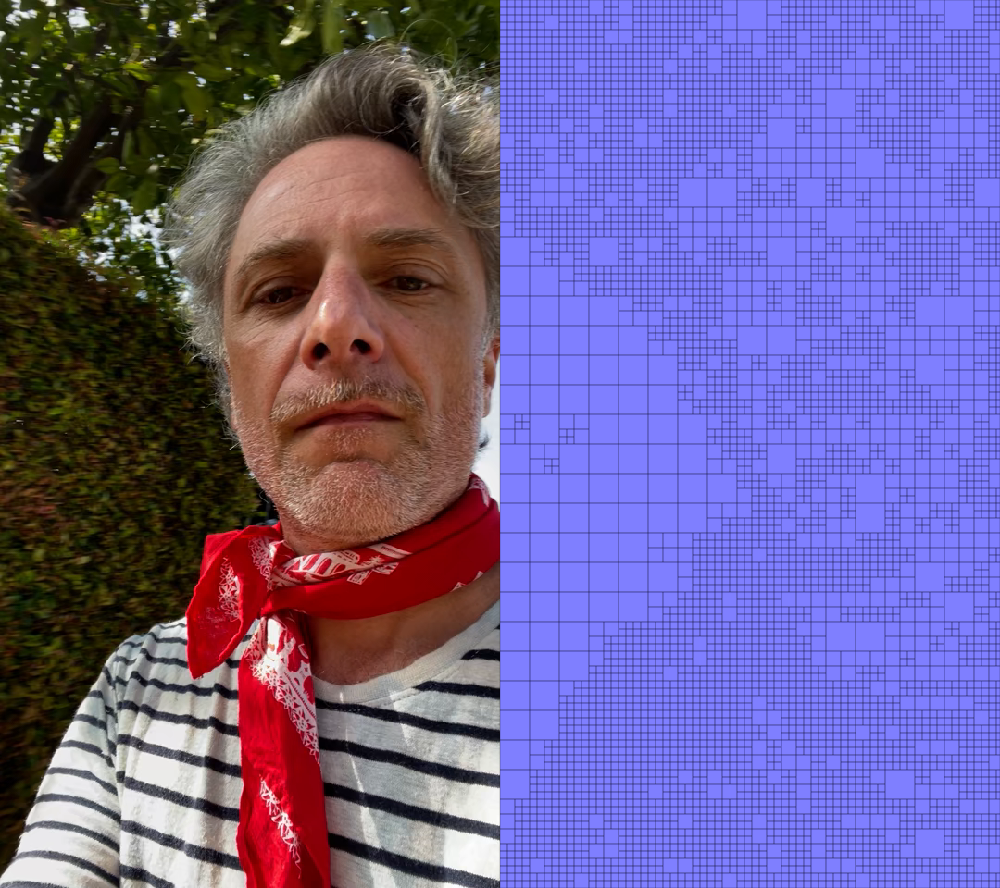
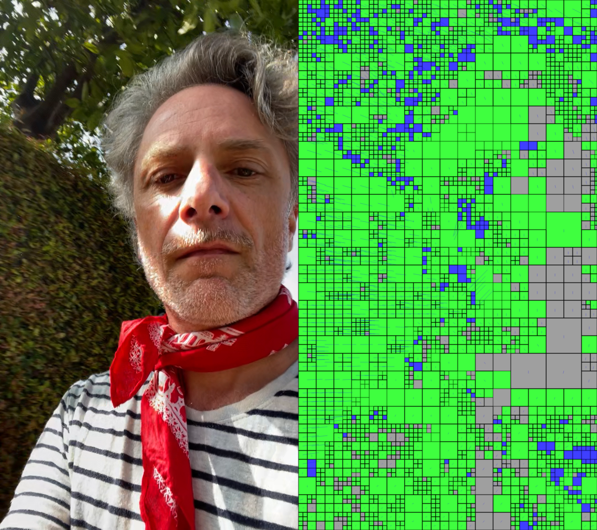
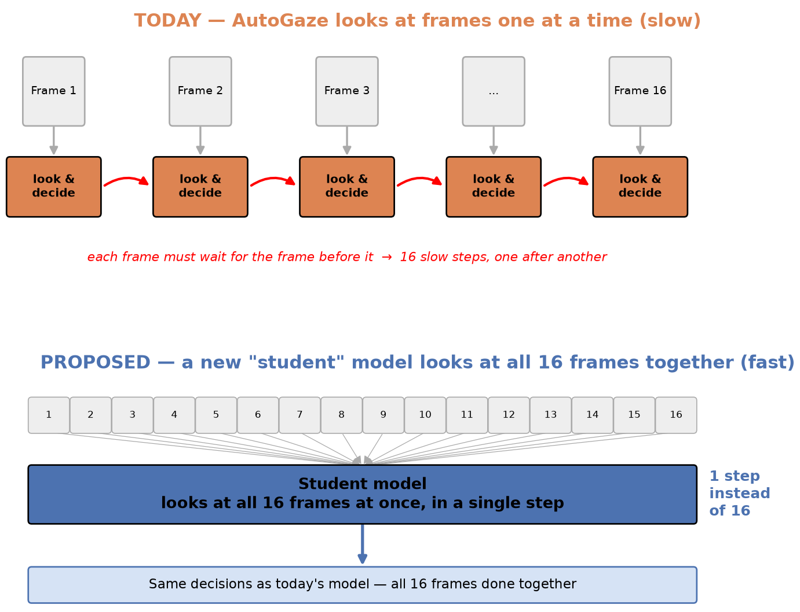

# Feasibility: Replacing AutoGaze's Selector with Codec Scoring

**Proposal:** Replace AutoGaze's autoregressive gaze-selector with motion- and residual-based codec scoring, in the style of LLaVA-OV-2's OneVision-Encoder, using the HEVC CTU quad-tree to approximate AutoGaze's multiscale gazing.

**Verdict: Feasible, worth pursuing.** Real profiling confirms the latency problem, and real bitstream tests confirm the codec signal exists. The open question has moved from "does the data exist?" to "can we extract it fast enough?"

**Team:** Tanveer Hannan, Hiba Yousef, Samuel Eadie, Fabian Brand

---

## Evidence

- The AutoGaze selector costs **6.1–7.0s per query** (73–74% of total latency, n=500/1395).
- End-to-end latency is **8.3–9.6s** for AutoGaze versus **5.3–5.7s** for dense processing — AutoGaze is **1.56–1.69× slower**, despite using 15–19× fewer LLM tokens and achieving better accuracy (+6.0pp on EgoSchema, +0.6pp on VideoMME).
- The ViT/LLM savings from gazing (~4s) are real; the selector itself is what consumes them.

 

- NVDEC does not expose true CU partition geometry — only a flat 16×16 QP/type/MV grid.
- The real partition tree and motion vectors can be obtained via **[libde265](https://github.com/ChristianFeldmann/libde265)**, a software decoder; a working dump tool already exists.
- Partition size tracks temporal correlation, not just texture: in the example above, frame 2's gray band corresponds to large blocks in a region that was finely split in frame 1, because it matched the reference frame.
- At high encoding quality, the encoder may keep re-splitting static texture into small blocks regardless, which could cause the signal to wash out in the production-quality regime. This remains untested.

### Supporting commentary — Samuel Eadie

> Regarding dumping partition structure from HEVC decoder for multi-scale patch selection:
>
> NVDEC doesn't support this naturally, it provides statistics on a regular 16x16 patch grid, destroying any partition structure information (we could try to reform larger patches by merging 16x16 patches with identical characteristics by assuming they originated from a single larger, e.g. 32x32, block but this is imperfect and perhaps slow)
>
> I've written a small program (thanks claude) to dump the partition information (also motion vectors etc) that we need alongside the decoded video from a software decoder ([libde265](https://github.com/ChristianFeldmann/libde265)), it's just a question of whether a software decoder is fast enough.
>
> Here are the first two frames of a test sequence. Both contain the partition structure. The first has just blue intra-coded blocks, the second has intra and inter coded blocks along with the applicable motion vectors.
>
> There are areas of the frame, e.g. in grey, where we use larger blocks in the second frame despite using smaller blocks in the first (showing that to some extent the partition structure also takes into account temporal correlations, and doesnt make us assign a lot of tokens to high-entropy areas across consecutive frames if nothing much changes from the first).
>
> At high quality (where I assume most of the training/inference data will be) it still has enough bitrate to repeatedly encode the same texture with small blocks, potentially limiting the effectiveness of this approach

---

## Risks

| # | Risk | Status |
|---|---|---|
| 1 | Software decode (libde265) may be too slow, reintroducing the latency this approach is meant to remove | Open — needs benchmark |
| 2 | CU-size signal may degrade at high encoding quality (bitrate-dependent) | Open — needs testing across the QP range |
| 3 | Rate-distortion complexity is not the same as semantic saliency (a different bias than AutoGaze's own VideoMAE-reconstruction flaw) | Unresolved, empirical question |
| 4 | True multiscale requires depth-adaptive token merging, not just new scores (OV-Encoder's 2×2 merge is fixed-granularity) | Deferred — MVP uses fixed-granularity scoring first |
| 5 | Only pays off for pre-compressed/stored video, not live camera capture | Low risk — matches AutoGaze's own stated use case |

<!-- ## Alternative already proposed internally

Repo's `README.md`: distill a "student" model that sees all frames in 1 forward pass instead of 16 sequential steps, trained to imitate the original selector.

Codec scoring = ~0 cost, different/untrained selection principle. Distillation = 16→1 steps (not ~0), preserves AutoGaze's original learned pattern. Worth comparing both. -->

## Accuracy Recovery

Once the selector becomes a deterministic rule, there is no selector left to fine-tune. Instead, fine-tune the **downstream ViT + LLM** on the new evidence distribution — analogous to LLaVA-OV-2's Stage 4 relative to the OV-Encoder.

---

## TODO

- [ ] **Benchmark libde265 decode throughput** on target hardware and videos; compare against the 6.1–7.0s per query it needs to beat.
- [ ] **Test CU-size signal quality across the QP/bitrate range** actually used in the target dataset, not just a single setting.
- [ ] **Confirm the NVDEC/PyNvVideoCodec 16×16-grid fallback** as a backup path if libde265 proves too slow: verify the exact driver version requirement and measure the "small overhead" referenced in the PyNvVideoCodec docs.
- [ ] **Build an MVP**: a fixed-granularity (non-multiscale) codec-score selector, swapped in place of AutoGaze's selector, using the same downstream ViT/LLM.
- [ ] **Fine-tune the downstream ViT + LLM** on the new (codec-selected) evidence distribution.
- [ ] **Evaluate the MVP** on EgoSchema + VideoMME, targeting ≥60.4%/55.6% accuracy (matching AutoGaze) at near-zero selector latency (versus the current 6.1–7.0s).
- [ ] **Compare against the student-distillation alternative** (described in this repo's README.md) on the same benchmarks before committing to one approach.
- [ ] **If the MVP accuracy gap is too large**, implement depth-adaptive token merging for true multiscale support (NaViT/quadtree-ViT style) and re-evaluate.

---
## Related Work
- **[OneVision-Encoder](https://arxiv.org/abs/2602.08683)** 
- **[LLaVA-OneVision-2](https://arxiv.org/abs/2605.25979)** 
