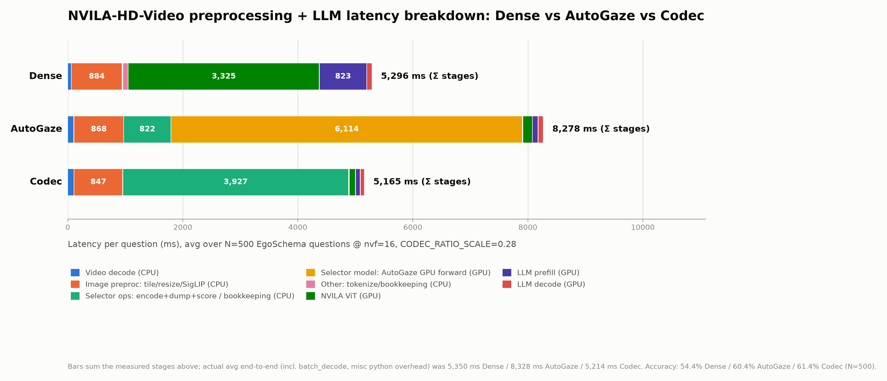
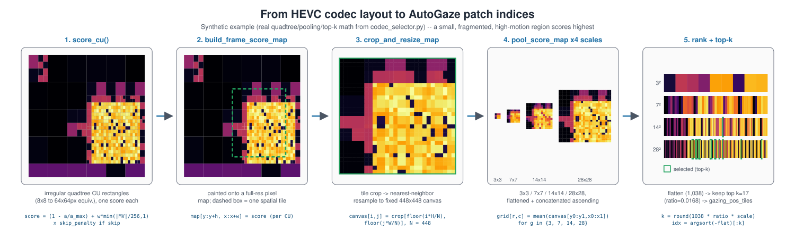

# Codec-Based Selector for AutoGaze: Results



`"codec"` mode (`scripts/breakdown`) vs. AutoGaze's trained selector, same base model
(**NVILA-8B-HD-Video**). Token-count-matched via `CODEC_RATIO_SCALE=0.28`. Caches
cleared before every run below except the videomme one (~3 questions/video, so most
items there hit a legitimate warm cache — split into cold/warm rows).

`avg selector cost` = `autogaze_ops_ms + autogaze_model_ms`. `avg VLM cost` =
`avg_e2e_ms − avg_preproc_ms`. `avg tokens` = final `input_ids` length.

## Concept

`codec_selector.build_gazing_info()` is a drop-in substitute for AutoGaze's trained
selector — same integration point, same output tensor schema. Instead of a trained
autoregressive model, it scores HEVC coding units (small + motion-heavy + non-skip →
high) and keeps a fixed top-k per frame.



## N=500 (full), egoschema, nvf=16

Source: [`benchmark_results/nvila_hd_accuracy_breakdown_summary_egoschema_nvf16.json`](benchmark_results/nvila_hd_accuracy_breakdown_summary_egoschema_nvf16.json)

| Mode | Accuracy | avg e2e | avg selector cost | avg VLM cost | avg tokens |
|---|---|---|---|---|---|
| `codec` (scale=0.28) | 307/500 = 61.4% | 5,214ms | 3,927ms | 315ms | 1,572 |
| `autogaze` | 302/500 = 60.4% | 8,328ms | 6,936ms | 409ms | 1,598 |
| `dense` (baseline) | 272/500 = 54.4% | 5,350ms | — | 4,294ms | 23,784 |

## N=1395 (full), videomme, nvf=16

Source: [`benchmark_results/nvila_hd_accuracy_breakdown_summary_video_mme_nvf16.json`](benchmark_results/nvila_hd_accuracy_breakdown_summary_video_mme_nvf16.json)
(`codec`'s cold/warm split is derived from the matching
[`*_video_mme_nvf16.jsonl`](benchmark_results/nvila_hd_accuracy_breakdown_codec_video_mme_nvf16.jsonl),
not stored in the summary directly — see the cold/warm caveat above).

| Mode | Accuracy | avg e2e | avg selector cost | avg VLM cost | avg tokens |
|---|---|---|---|---|---|
| `codec`, all (33% cold / 67% warm) | 780/1395 = 55.9% | 4,021ms | 2,709ms | 311ms | 1,547 |
| `codec`, cold only (n=465) | 55.7% | 6,135ms | 4,771ms | 320ms | 1,546 |
| `codec`, warm only (n=930) | 56.0% | 2,963ms | 1,678ms | 306ms | 1,548 |
| `autogaze`, all | 775/1395 = 55.6% | 9,571ms | 8,101ms | 352ms | 1,526 |
| `dense`, all (baseline) | 766/1395 = 54.9% | 5,666ms | — | 4,576ms | 28,318 |

---

## Reproducing

```bash
source /home/scratch.thannan_wwfo/miniforge-aarch64/etc/profile.d/conda.sh
conda activate auto_gaze  # GB200 = aarch64; build hevc_dump/cmake_build_aarch64 first if missing

run() {  # $1=dataset $2=nvf
  rm -rf data/hevc_dump_cache/*
  rm -f benchmark_results/nvila_hd_accuracy_breakdown_codec_${1}_nvf${2}.jsonl
  CUDA_VISIBLE_DEVICES=0 REPO_DIR=$(pwd) NVILA_DEVICE=cuda:0 \
    PYTORCH_CUDA_ALLOC_CONF=expandable_segments:True \
    FIXED_NUM_VIDEO_FRAMES=$2 N_SAMPLES=full MAX_BATCH_SIZE_AUTOGAZE=64 MODES=codec,autogaze,dense \
    CODEC_RATIO_SCALE=0.28 DATASET=$1 python3 scripts/nvila_hd_accuracy_breakdown_test.py
}
run egoschema 16
run video_mme 16

# Results: benchmark_results/nvila_hd_accuracy_breakdown_summary_{egoschema,video_mme}_nvf16.json
```

## Integration: how `hevc_dump` is wired in

**TL;DR:** [`hevc_dump`](https://gitlab-master.nvidia.com/seadie/hevc_dump) is Sam's tool — feed it an
HEVC video, it hands back a CSV describing every coding block (motion, size, residual, etc.). It has no
idea AutoGaze exists. This repo calls it as a subprocess, turns its CSV into patch scores, and hands the
result to NVILA-HD *pretending* to be AutoGaze. Below is what actually happens, in order, when `codec`
mode runs.

**Step 0 — the swap.** Normally, NVILA-HD asks the real AutoGaze model "which patches matter?". In
`instrumentation.py:59-79`, that call is intercepted: if codec mode is on, we answer the question
ourselves via `codec_selector.build_gazing_info(...)` instead of asking AutoGaze. Our answer is shaped
exactly like AutoGaze's would be, so nothing else in the pipeline notices the substitution.

**Step 1 — make a mini video clip.** `hevc_dump` needs an actual HEVC bitstream to decode, and we don't
want to encode/decode the *whole* video just to look at 16 frames. So `_extract_and_encode_windows()`
(`codec_selector.py`) grabs a short window of frames around each frame we care about and encodes just
that into a small HEVC file — this is the same thing as the README's `ffmpeg -c:v libx265 ...` example,
just done in Python instead of typed at a terminal.

**Step 2 — run `dump_stats` on it.** `get_or_build_stats()` (`codec_selector.py`) then runs the exact
command from the README:
```
dump_stats  <our mini .hevc file>  <scratch .yuv output>  <output .csv>
```
(literally `os.system(f'"{DUMP_STATS_BIN}" "{hevc_path}" "{yuv_path}" "{csv_path}"')` — same 3 arguments,
just filled in from variables). This is the actual point where Sam's binary gets invoked.

**Step 3 — turn the CSV into patch scores.** The CSV lists things like "this 16×16 block had this much
motion, this much residual energy, was/wasn't skipped." `hevc_to_gaze.py` reads that CSV and scores each
block (small + moving + not-skipped = important), then converts those scores into the same
"which patches to keep" format AutoGaze uses.

**One thing worth knowing:** `hevc_dump` ships its own CSV→AutoGaze-patch scorer (`hevc_autogaze.py`,
using geometric/ordinal matching). **We don't use it.** `hevc_to_gaze.py` is a separate, independently
written scorer. If you're expecting Sam's scoring logic to be live here, it isn't — this repo has its own.
