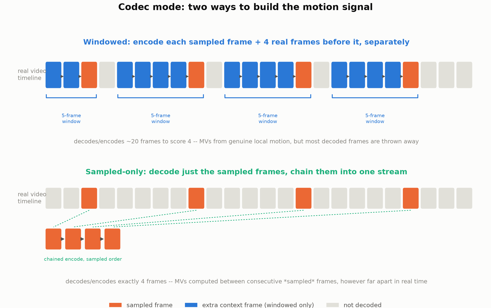
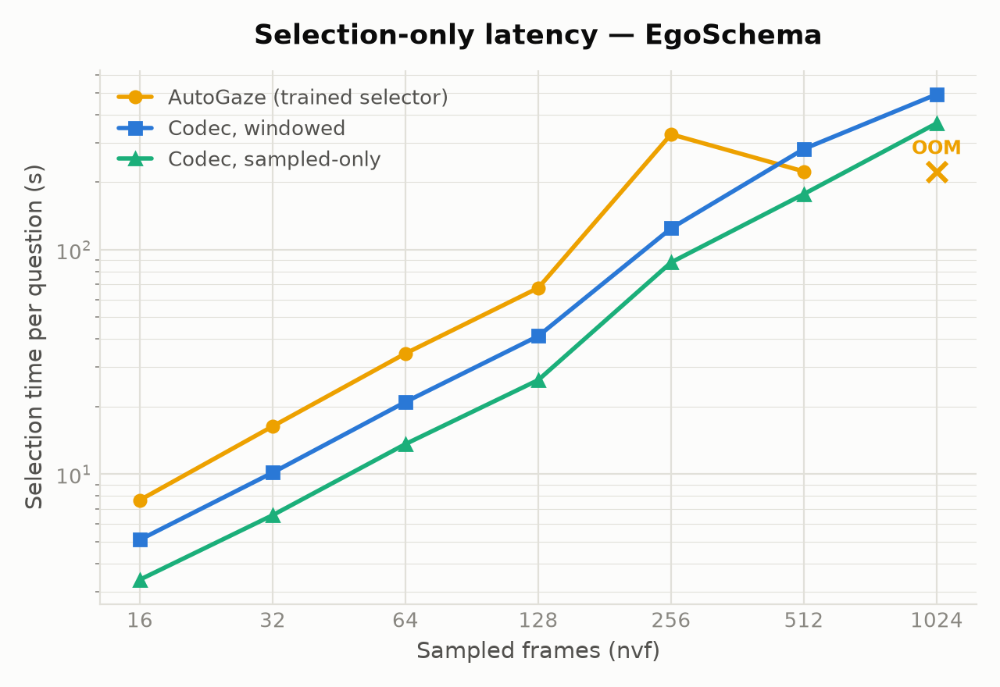
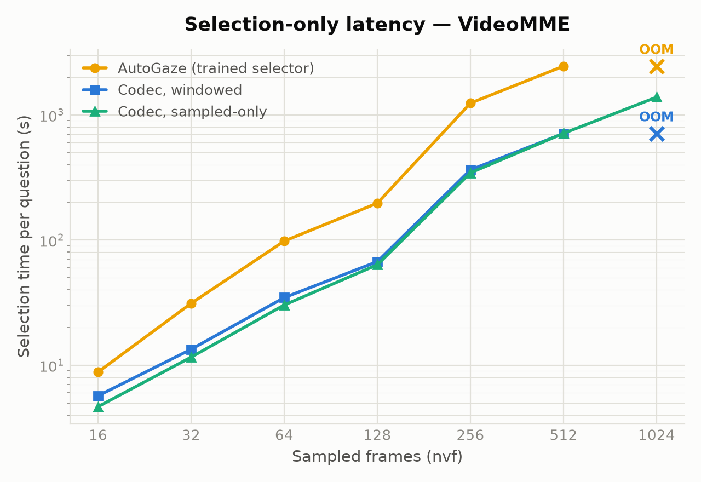

# Replace AutoGaze Autoregressive Token Selector with Codec Based Heuristic

## Summary

- Matches AutoGaze on accuracy and beats it on latency up to ~128 sampled frames
- Above ~256 frames both hit scaling limits before the LLM does — at nvf=1024, only
  codec's **sampled-only** survives; AutoGaze and codec-windowed hard-crash (OOM).

## Results

**1. At 16 frames, codec matches AutoGaze on accuracy and is faster end-to-end:**

Side by side, same video, same nvf:
[EgoSchema](figures/codec_vs_autogaze_egoschema_comparison.mp4) ·
[VideoMME](figures/codec_vs_autogaze_video_mme_comparison.mp4)

| Mode | Accuracy | Total time | Selection time | LLM time | Tokens |
|---|---|---|---|---|---|
| **EgoSchema, N=500** | | | | | |
| codec | **61.4%** | **5.2s** | **3.9s** | **0.3s** | **1,572** |
| AutoGaze | 60.4% | 8.3s | 6.9s | 0.4s | 1,598 |
| dense (no selection) | 54.4% | 5.4s | — | 4.3s | 23,784 |
| **VideoMME, N=1,395** | | | | | |
| codec | **55.9%** | **4.0s** | **2.7s** | **0.3s** | 1,547 |
| AutoGaze | 55.6% | 9.6s | 8.1s | 0.4s | **1,526** |
| dense | 54.9% | 5.7s | — | 4.6s | 28,318 |

**2. Windowed vs. sampled-only: same accuracy, sampled-only is consistently faster:**



| Frames | EgoSchema acc. | Windowed | Sampled-only | Δ | VideoMME acc. | Windowed | Sampled-only | Δ |
|---|---|---|---|---|---|---|---|---|
| 16 | 68.0% | **4.1s** | 4.2s | +1.6% | 60.0% | 6.6s | **5.6s** | -15.5% |
| 32 | 64/60%* | 11.0s | **7.6s** | -31.2% | 60.0% | 14.6s | **12.3s** | -15.8% |
| 64 | 68.0% | 17.2s | **15.4s** | -10.8% | 64.0% | 38.1s | **33.7s** | -11.4% |
| 128 | 68.0% | 34.1s | **30.0s** | -12.0% | — | — | 67.5s | — |
| 256 | 60.0% | 133.6s | **103.2s** | -22.8% | | | | |
| 512 | 40.0% | 152.6s | **92.4s** | -39.4% | | | | |
| 1024 | 12.0% | **324.8s** | 419.1s | +29.0% | | | | |

*64% vs. 60% at 32 frames on EgoSchema is likely N=25 noise. Accuracy degrades past 128
frames and keeps falling — 12% by 1024.

**3. Matching AutoGaze's actual chunking (restart encoding every 16 frames, keep full
detail on each chunk's first frame) did not help:**

| Dataset | Sampled-only (128 frames) | + restart/anchor | Tokens |
|---|---|---|---|
| EgoSchema | **68.0%** | **68.0%** | 37,873 vs. **25,129** (1.5x) |
| VideoMME | **76.0%** | 48.0% | 86,240 vs. **53,035** (1.6x) |


**4. Isolating selection time alone (no ViT, no LLM)**




<details>
<summary>Scaling numbers and nvf=1024 crash details</summary>

16→128 frames (8x): AutoGaze grows 8.8x (EgoSchema)/22.3x (VideoMME) vs. codec's
12-14x — by 512 frames AutoGaze on VideoMME hits 2,448s/question, ~3x either codec
variant (~750s).

AutoGaze hard-crashes at nvf=1024 on **both** datasets; codec-windowed crashes there too
on VideoMME (EgoSchema windowed survives) — all confirmed OOM kills (~985-987GB
resident), reproduced 2-3/3 tries regardless of batch size. Only **sampled-only**
finishes the full sweep on both datasets (419s EgoSchema, 1,384s VideoMME) — the extra
real-frame context windowing and AutoGaze's own model both carry is what tips memory
over the edge; sampled-only's flat per-frame footprint doesn't.

</details>


## Videos

nvf=16 unless noted — patch selection overlaid on the actual frames, not just numbers.
(AutoGaze vs. codec side by side is under Finding 1, above.)

- **[Whole video, dense 16-frame chunks](figures/full_video_codec_egoschema.mp4)** —
  codec run the way AutoGaze's own QUICK_START.md prescribes: back-to-back chunks from
  frame 0, no sparse sampling (constant 125 patches/frame)
- **[+ full-first-frame anchor per chunk](figures/full_video_codec_egoschema_fullfirstframe.mp4)**
  — same, but every patch kept on each chunk's first frame (1,038 patches at chunk
  boundaries); [VideoMME, ~20s crop](figures/full_video_codec_video_mme_fullfirstframe.mp4)
  — this video's higher motion complexity OOMs the CU-level scoring cache at
  anything longer, independent of frame count
- **[+ restart-coding/chunk vs. real AutoGaze](figures/restarted_chunks_vs_autogaze_egoschema.mp4)**
  — codec restarted every 16 frames + full-first-frame anchor, run head-to-head against
  AutoGaze's real trained selector on the same video (AutoGaze holds constant at 109
  patches/frame)

## Reproducing

All commands: `conda activate auto_gaze` first (GB200 = aarch64; build
`hevc_dump/cmake_build_aarch64` before any codec-mode run). Swap
`DATASET=egoschema` for `DATASET=video_mme` to run the other dataset.

<details>
<summary><strong>Commands for every experiment above (click to expand)</strong></summary>

**Finding 1 — nvf=16 accuracy/latency, full dataset, all three modes:**

```bash
CUDA_VISIBLE_DEVICES=0 REPO_DIR=$(pwd) NVILA_DEVICE=cuda:0 \
  FIXED_NUM_VIDEO_FRAMES=16 N_SAMPLES=full MAX_BATCH_SIZE_AUTOGAZE=32 MODES=codec,autogaze,dense \
  CODEC_RATIO_SCALE=0.28 DATASET=egoschema python3 scripts/nvila_hd_accuracy_breakdown_test.py
```

**Finding 2 — windowed vs. sampled-only accuracy sweep, N=25:**

```bash
for nvf in 16 32 64 128 256 512; do
  # windowed: real local-frame context around each sampled frame (default)
  REPO_DIR=$(pwd) NVILA_DEVICE=cuda:0 FIXED_NUM_VIDEO_FRAMES=$nvf N_SAMPLES=25 \
    MODES=codec DATASET=egoschema EXTRA_SUFFIX=_windowedn25_$nvf \
    python3 scripts/nvila_hd_accuracy_breakdown_test.py

  # sampled-only: just the sampled frames, chained, no extra context
  REPO_DIR=$(pwd) NVILA_DEVICE=cuda:0 FIXED_NUM_VIDEO_FRAMES=$nvf N_SAMPLES=25 \
    MODES=codec DATASET=egoschema CODEC_SAMPLED_ONLY=1 EXTRA_SUFFIX=_sampledonly$nvf \
    python3 scripts/nvila_hd_accuracy_breakdown_test.py
done
```

**Finding 3 — restart-every-16-frames + full-first-frame anchor, N=25:**

```bash
REPO_DIR=$(pwd) NVILA_DEVICE=cuda:0 FIXED_NUM_VIDEO_FRAMES=128 N_SAMPLES=25 \
  MODES=codec DATASET=egoschema \
  CODEC_SAMPLED_ONLY=1 CODEC_GOP_RESTART=16 CODEC_FULL_FIRST_FRAME=1 \
  EXTRA_SUFFIX=_restart16_fff \
  python3 scripts/nvila_hd_accuracy_breakdown_test.py
```

**Finding 4 — selection-only latency (no LLM, avoids the high-nvf OOM), autogaze vs.
windowed vs. sampled-only:**

```bash
for nvf in 16 32 64 128 256 512 1024; do
  # AutoGaze's own trained selector
  REPO_DIR=$(pwd) NVILA_DEVICE=cuda:0 SKIP_LLM=1 FIXED_NUM_VIDEO_FRAMES=$nvf N_SAMPLES=25 \
    DATASET=egoschema MODES=autogaze EXTRA_SUFFIX=_selectoronly_autogaze$nvf \
    python3 scripts/nvila_hd_accuracy_breakdown_test.py

  # codec, windowed
  REPO_DIR=$(pwd) NVILA_DEVICE=cuda:0 SKIP_LLM=1 FIXED_NUM_VIDEO_FRAMES=$nvf N_SAMPLES=25 \
    DATASET=egoschema MODES=codec EXTRA_SUFFIX=_selectoronly_windowedn25_$nvf \
    python3 scripts/nvila_hd_accuracy_breakdown_test.py

  # codec, sampled-only
  REPO_DIR=$(pwd) NVILA_DEVICE=cuda:0 SKIP_LLM=1 FIXED_NUM_VIDEO_FRAMES=$nvf N_SAMPLES=25 \
    DATASET=egoschema MODES=codec CODEC_SAMPLED_ONLY=1 EXTRA_SUFFIX=_selectoronly_sampledonly$nvf \
    python3 scripts/nvila_hd_accuracy_breakdown_test.py
done
```

**Videos** (side-by-side visualizations, no accuracy/latency measurement — build a
processor + run one video through both selectors):

```bash
# AutoGaze vs. codec, sampled frames only
python3 scripts/visualize_codec_vs_autogaze_video.py --video <path.mp4> --out figures/out.mp4

# whole video, real consecutive 16-frame chunks (add --full-first-frame for the anchor variant)
python3 scripts/visualize_full_video_codec.py --video <path.mp4> --out figures/out.mp4

# AutoGaze vs. codec restart-every-16 + full-first-frame/chunk
python3 scripts/visualize_restarted_chunks_vs_autogaze.py --video <path.mp4> --out figures/out.mp4
```

Env knobs used above: `SKIP_LLM=1` selection-latency only (never loads the 8B model) ·
`CODEC_SAMPLED_ONLY=1` sampled-only encoding · `CODEC_GOP_RESTART=N` force an I-frame
every N sampled frames · `CODEC_FULL_FIRST_FRAME=1` keep every patch on each chunk's
first frame · `N_SAMPLES=full|<int>` dataset size · `EXTRA_SUFFIX` keeps result files
from clobbering each other across sweep points.

</details>

## Implementation

`"codec" mode` scores each coding block by size, motion, and skip status (small +
moving + not-skipped = important) via `codec_selector.build_gazing_info()`, which
intercepts NVILA-HD's `_get_gazing_info_from_videos` at the exact point AutoGaze's own
selector runs and returns the same tensor shapes — no changes to NVILA-HD itself.

Under the hood: [`hevc_dump`](https://gitlab-master.nvidia.com/seadie/hevc_dump)
decodes HEVC into a CSV of per-block motion/size/residual stats.
`codec_selector.py` encodes the sampled frames, runs `dump_stats`, and
`hevc_to_gaze.py` scores each block and converts to AutoGaze's patch-index format.
(`hevc_dump`'s own scorer, `hevc_autogaze.py`, is unused; `hevc_to_gaze.py` is
independent.)

## Related Work: How LLaVA-OneVision-2 Handles This

We sample frames first, then recover motion from the gaps. LLaVA-OneVision-2 skips sampling entirely: scores saliency on *every* real frame of
the compressed stream, with adaptive GOP boundaries that let frame
allocation fall out of the motion signal instead of preceding it.

Unaddressed: they never report compute/memory cost for this. They do train at up to
768 frames/10-15min without incident, though, which points our OOM wall more at this
repo's `max_tiles_video` coupling bug than an inherent limit.

## Next Steps

1. AutoGaze: Integrate NVDEC into codec mode.
2. Implement LLaVA-OneVision-2's actual approach:
   1. Profile its real latency — the paper never reports this.
   2. Add NVDEC to that pipeline.

