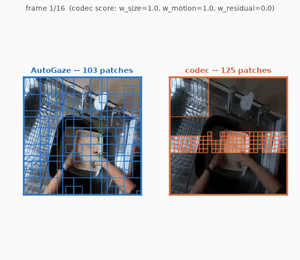
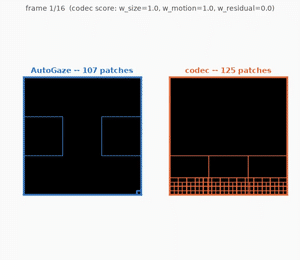
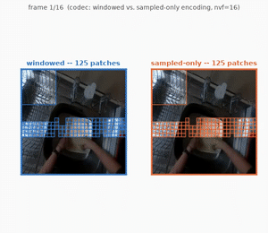
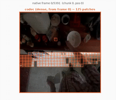
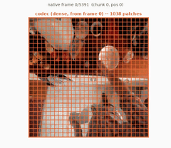
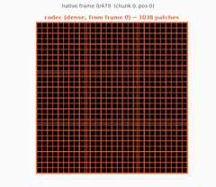
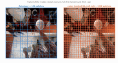

# Codec-Based Patch Selection: A Feasibility Study

> See the [README](README.md) for setup, installation, and AutoGaze's own baseline latency breakdown.

AutoGaze speeds up NVILA-HD-Video by feeding the LLM only the informative patches per
frame, picked by a trained selector model. This tests a free substitute: HEVC encoding
already computes a per-block motion vector during normal compression — threshold on
that instead of training anything.

## Summary

- Matches AutoGaze on accuracy and beats it on latency up to ~128 sampled frames.
- Above ~256 frames both hit scaling limits before the LLM does — at nvf=1024, only
  codec's **sampled-only** variant survives; AutoGaze and codec-windowed hard-crash (OOM).

## Results

### 1. At 16 frames, codec matches AutoGaze on accuracy and is faster end-to-end

<table>
<tr>
<td align="center"><b>EgoSchema</b><br>
<br>
<a href="figures/codec_vs_autogaze_egoschema_comparison.mp4">full-res</a></td>
<td align="center"><b>VideoMME</b><br>
<br>
<a href="figures/codec_vs_autogaze_video_mme_comparison.mp4">full-res</a></td>
</tr>
</table>

| Mode | Accuracy | Total time | Selection time | LLM time | Tokens |
|---|---|---|---|---|---|
| **EgoSchema, N=500** | | | | | |
| codec | **61.4%** | **5.2s** | **3.9s** | **0.3s** | **1,572** |
| AutoGaze | 60.4% | 8.3s | 6.9s | 0.4s | 1,598 |
| dense (no selection) | 54.4% | 5.4s | — | 4.3s | 23,784 |
| **VideoMME, N=1,395** | | | | | |
| codec | **55.9%** | **4.0s** | **2.7s** | **0.3s** | 1,547 |
| AutoGaze | 55.6% | 9.6s | 8.1s | 0.4s | **1,526** |
| dense | 54.9% | 5.7s | — | 4.6s | 28,318 |

<details>
<summary>Commands</summary>

```bash
CUDA_VISIBLE_DEVICES=0 REPO_DIR=$(pwd) NVILA_DEVICE=cuda:0 \
  FIXED_NUM_VIDEO_FRAMES=16 N_SAMPLES=full MAX_BATCH_SIZE_AUTOGAZE=32 MODES=codec,autogaze,dense \
  CODEC_RATIO_SCALE=0.28 DATASET=egoschema python3 scripts/nvila_hd_accuracy_breakdown_test.py

# comparison video
python3 scripts/visualize_codec_vs_autogaze_video.py --video <path.mp4> --out figures/out.mp4
```

</details>

### 2. Windowed vs. sampled-only: same accuracy, sampled-only is consistently faster

AutoGaze itself starts from a limitation: it samples frames sparsely across the video
instead of working on the continuous stream, because keeping every frame around is what
OOMs (see Finding 4). Codec mode inherited that when we adopted it, and both encoding
variants here still carry it — neither ever scores genuinely consecutive real frames.
Windowed decodes a few real frames of local context around each sampled point, but the
sampled points themselves can still be seconds apart; sampled-only skips that context
entirely and computes motion vectors directly between samples, treating far-apart frames
as if adjacent. Neither matches what HEVC motion vectors are actually designed to
measure — prediction between frames a fraction of a second apart, not whatever gap
sparse sampling happens to leave.

**LLaVA-OneVision-2** seems to solve this — it scores saliency on *every* real frame of
the compressed stream, with adaptive GOP boundaries that let frame allocation fall out
of the motion signal instead of preceding it, and no sparse-sampling gap to begin with.
Its own problem: the paper shows $\color{red}{\textbf{no latency or memory numbers}}$
anywhere for this pipeline — not for the codec-stream preprocessing, not for training,
not for inference. It does train at up to 768 frames/10-15min without incident, which points our OOM wall
more at this repo's `max_tiles_video` coupling bug than an inherent limit — but "seems
to" is doing real work in that sentence.

<table>
<tr>
<td align="center"><b>Concept</b><br>
</td>
<td align="center"><b>Same video, both variants</b><br>
<br>
<a href="figures/windowed_vs_sampledonly_egoschema.mp4">full-res</a></td>
</tr>
</table>

| Frames | EgoSchema acc. | Windowed | Sampled-only | Δ | VideoMME acc. | Windowed | Sampled-only | Δ |
|---|---|---|---|---|---|---|---|---|
| 16 | 68.0% | **4.1s** | 4.2s | +1.6% | 60.0% | 6.6s | **5.6s** | -15.5% |
| 32 | 64/60%* | 11.0s | **7.6s** | -31.2% | 60.0% | 14.6s | **12.3s** | -15.8% |
| 64 | 68.0% | 17.2s | **15.4s** | -10.8% | 64.0% | 38.1s | **33.7s** | -11.4% |
| 128 | 68.0% | 34.1s | **30.0s** | -12.0% | | |  | |
| 256 | 60.0% | 133.6s | **103.2s** | -22.8% | | | | |
| 512 | 40.0% | 152.6s | **92.4s** | -39.4% | | | | |
| 1024 | 12.0% | **324.8s** | 419.1s | +29.0% | | | | |

*64% vs. 60% at 32 frames on EgoSchema is likely N=25 noise. Accuracy degrades past 128
frames and keeps falling — 12% by 1024.

<details>
<summary>Commands</summary>

```bash
for nvf in 16 32 64 128 256 512; do
  # windowed: real local-frame context around each sampled frame (default)
  REPO_DIR=$(pwd) NVILA_DEVICE=cuda:0 FIXED_NUM_VIDEO_FRAMES=$nvf N_SAMPLES=25 \
    MODES=codec DATASET=egoschema EXTRA_SUFFIX=_windowedn25_$nvf \
    python3 scripts/nvila_hd_accuracy_breakdown_test.py

  # sampled-only: just the sampled frames, chained, no extra context
  REPO_DIR=$(pwd) NVILA_DEVICE=cuda:0 FIXED_NUM_VIDEO_FRAMES=$nvf N_SAMPLES=25 \
    MODES=codec DATASET=egoschema CODEC_SAMPLED_ONLY=1 EXTRA_SUFFIX=_sampledonly$nvf \
    python3 scripts/nvila_hd_accuracy_breakdown_test.py
done
```

`CODEC_SAMPLED_ONLY=1` sampled-only encoding · `N_SAMPLES=full|<int>` dataset size ·
`EXTRA_SUFFIX` keeps result files from clobbering each other across sweep points.

</details>

### 3. Matching AutoGaze's actual chunking did not help

Restart encoding every 16 frames, keep full detail on each chunk's first frame — built
up here in three steps: dense chunks, + anchor frame, + restart vs. real AutoGaze.

<table>
<tr>
<td align="center"><b>Dense chunks</b><br>
<br>
125 patches/frame · <a href="figures/full_video_codec_egoschema.mp4">full-res</a></td>
<td align="center"><b>+ full-first-frame anchor</b><br>
<br>
1,038 patches at boundaries · <a href="figures/full_video_codec_egoschema_fullfirstframe.mp4">full-res</a></td>
</tr>
<tr>
<td align="center"><b>Same, VideoMME (~20s crop)</b><br>
<br>
higher motion complexity caps duration · <a href="figures/full_video_codec_video_mme_fullfirstframe.mp4">full-res</a></td>
<td align="center"><b>+ restart vs. real AutoGaze</b><br>
<br>
AutoGaze constant at 109 patches/frame · <a href="figures/restarted_chunks_vs_autogaze_egoschema.mp4">full-res</a></td>
</tr>
</table>

| Dataset | Sampled-only (128 frames) | + restart/anchor | Tokens |
|---|---|---|---|
| EgoSchema | **68.0%** | **68.0%** | 37,873 vs. **25,129** (1.5x) |
| VideoMME | **76.0%** | 48.0% | 86,240 vs. **53,035** (1.6x) |

<details>
<summary>Commands</summary>

```bash
REPO_DIR=$(pwd) NVILA_DEVICE=cuda:0 FIXED_NUM_VIDEO_FRAMES=128 N_SAMPLES=25 \
  MODES=codec DATASET=egoschema \
  CODEC_SAMPLED_ONLY=1 CODEC_GOP_RESTART=16 CODEC_FULL_FIRST_FRAME=1 \
  EXTRA_SUFFIX=_restart16_fff \
  python3 scripts/nvila_hd_accuracy_breakdown_test.py

# whole video, real consecutive 16-frame chunks (add --full-first-frame for the anchor variant)
python3 scripts/visualize_full_video_codec.py --video <path.mp4> --out figures/out.mp4

# restart-every-16 + full-first-frame vs. real AutoGaze
python3 scripts/visualize_restarted_chunks_vs_autogaze.py --video <path.mp4> --out figures/out.mp4
```

`CODEC_GOP_RESTART=N` force an I-frame every N sampled frames ·
`CODEC_FULL_FIRST_FRAME=1` keep every patch on each chunk's first frame.

</details>

### 4. Isolating selection time alone (no ViT, no LLM)

<table>
<tr>
<td align="center"></td>
<td align="center"></td>
</tr>
</table>

<details>
<summary>Scaling rate and OOM root cause</summary>

16→128 frames (8x): AutoGaze grows 8.8x (EgoSchema)/22.3x (VideoMME) vs. codec's 12-14x
— clearly super-linear well before any crash.

All three OOMs are confirmed real host-RAM kills (~985-987GB resident), reproduced 2-3/3
tries regardless of batch size — not a hang. Windowing's extra real-frame context and
AutoGaze's own model both carry memory that scales with frame count; sampled-only's flat
per-frame footprint doesn't, which is why it's the only variant that survives nvf=1024
on both datasets.

**Commands:**

```bash
for nvf in 16 32 64 128 256 512 1024; do
  # AutoGaze's own trained selector
  REPO_DIR=$(pwd) NVILA_DEVICE=cuda:0 SKIP_LLM=1 FIXED_NUM_VIDEO_FRAMES=$nvf N_SAMPLES=25 \
    DATASET=egoschema MODES=autogaze EXTRA_SUFFIX=_selectoronly_autogaze$nvf \
    python3 scripts/nvila_hd_accuracy_breakdown_test.py

  # codec, windowed
  REPO_DIR=$(pwd) NVILA_DEVICE=cuda:0 SKIP_LLM=1 FIXED_NUM_VIDEO_FRAMES=$nvf N_SAMPLES=25 \
    DATASET=egoschema MODES=codec EXTRA_SUFFIX=_selectoronly_windowedn25_$nvf \
    python3 scripts/nvila_hd_accuracy_breakdown_test.py

  # codec, sampled-only
  REPO_DIR=$(pwd) NVILA_DEVICE=cuda:0 SKIP_LLM=1 FIXED_NUM_VIDEO_FRAMES=$nvf N_SAMPLES=25 \
    DATASET=egoschema MODES=codec CODEC_SAMPLED_ONLY=1 EXTRA_SUFFIX=_selectoronly_sampledonly$nvf \
    python3 scripts/nvila_hd_accuracy_breakdown_test.py
done
```

`SKIP_LLM=1` selection-latency only (never loads the 8B model).

</details>

## Implementation

`"codec" mode` scores each coding block by size, motion, and skip status (small +
moving + not-skipped = important) via `codec_selector.build_gazing_info()`, which
intercepts NVILA-HD's `_get_gazing_info_from_videos` at the exact point AutoGaze's own
selector runs and returns the same tensor shapes — no changes to NVILA-HD itself.

Under the hood: [`hevc_dump`](https://gitlab-master.nvidia.com/seadie/hevc_dump)
decodes HEVC into a CSV of per-block motion/size/residual stats. `codec_selector.py`
encodes the sampled frames, runs `dump_stats`, and `hevc_to_gaze.py` scores each block
and converts to AutoGaze's patch-index format. (`hevc_dump`'s own scorer,
`hevc_autogaze.py`, is unused; `hevc_to_gaze.py` is independent.)

<details>
<summary>Setup for the commands throughout Results</summary>

`conda activate auto_gaze` first (GB200 = aarch64; build `hevc_dump/cmake_build_aarch64`
before any codec-mode run). Swap `DATASET=egoschema` for `DATASET=video_mme` to run the
other dataset. GIFs are downsampled previews — captions link the full-res video.

</details>

## Single-Video Sanity Check (vs. LLaVA-OneVision-2)

Same two videos as LLaVA-OV-2's own frames-vs-codec smoke test
(`llava_onevision2_repro/SMOKE_TEST.md`, separate repo), run through this
repo's pipeline at nvf=16 — different VLM, different selector, not a
controlled comparison, just a rough cross-check with the same source videos.

| Dataset | Mode | Tokens | Encode | Selector | ViT | LLM | E2E |
|---|---|---:|---:|---:|---:|---:|---:|
| EgoSchema (0074f737…, 180s) | dense | 23,176 | — | — | 2.4s | 1.5s | **5.1s** |
| EgoSchema | AutoGaze | **1,593** | — | 6.2s | 0.2s | 0.3s | 8.3s |
| EgoSchema | codec | 2,555 | 0.3s | 4.9s* | 0.2s | 0.3s | 6.3s |
| VideoMME (001-1, fFjv93ACGo8) | dense | 28,703 | — | — | 2.9s | 1.6s | 5.7s |
| VideoMME | AutoGaze | **1,655** | — | 7.2s | 0.2s | 0.2s | 9.7s |
| VideoMME | codec | 2,930 | 0.2s | 3.7s* | 0.3s | 0.3s | **5.3s** |

*codec's "selector" column includes its own encode step (the transcode
analog — codec only re-encodes the sampled frames, not the whole video, so
it's much cheaper here than LLaVA-OV-2's whole-video H264 transcode).
AutoGaze's "selector" is its own trained model's GPU forward pass, which has
no analog in the frames-only baseline.

Dense is fastest E2E here despite ~15x more tokens — the ViT/LLM cost of
those tokens is still cheaper than AutoGaze's own selector-model overhead
(6-7s) at such a small budget. This matches Finding 1: the crossover where
selection actually pays off starts around nvf=64-128, not 16.

Confirmed at N=25/dataset (not just these two videos): dense stays fastest
E2E at nvf=16 both places — 4.4s/5.1s (EgoSchema/VideoMME) vs. codec's
5.6s/6.4s vs. AutoGaze's 8.1s/9.2s — matching Finding 1's full-dataset
numbers closely (AutoGaze's own selector-model overhead is what keeps it
slowest at this frame count, same story as N=1).

### Frame-count sweep: nvf=16 → 1024 (same two videos, patch-selector only)

Same two videos, patch-selector latency only (`SKIP_LLM=1`, no ViT/LLM), across
the full nvf range used in the main sweep (Findings 1-4). Encode is codec's x265
pass over just the sampled frames; Selector is AutoGaze's own trained-model
forward pass for AutoGaze rows, or codec's motion-vector scoring pass (no GPU
model) for codec rows.

| Dataset | Mode | nvf | Tokens | Encode | Selector | E2E |
|---|---|---:|---:|---:|---:|---:|
| EgoSchema | AutoGaze | 16 | 1,593 | — | 0.8s | 8.6s |
| EgoSchema | AutoGaze | 32 | 2,949 | — | 12.4s | 15.8s |
| EgoSchema | AutoGaze | 64 | — | — | — | **OOM** |
| EgoSchema | AutoGaze | 128 | — | — | — | **OOM** |
| EgoSchema | AutoGaze | 256 | — | — | — | **OOM** |
| EgoSchema | AutoGaze | 512 | — | — | — | **OOM** |
| EgoSchema | AutoGaze | 1024 | — | — | — | **OOM** |
| EgoSchema | codec | 16 | 2,555 | 0.3s† | 2.5s | 3.7s |
| EgoSchema | codec | 32 | 5,006 | 0.7s | 7.9s | 10.6s |
| EgoSchema | codec | 64 | 9,908 | cached‡ | 10.9s | 13.7s |
| EgoSchema | codec | 128 | 19,712 | 2.3s | 30.0s | 38.0s |
| EgoSchema | codec | 256 | 39,320 | 4.7s | 56.9s | 74.1s |
| EgoSchema | codec | 512 | 78,536 | 9.4s | 116.0s | 147.8s |
| EgoSchema | codec | 1024 | 156,968 | 18.7s | 238.5s | 314.4s |
| VideoMME | AutoGaze | 16 | 1,655 | — | 0.9s | 9.8s |
| VideoMME | AutoGaze | 32 | 3,682 | — | 26.1s | 32.4s |
| VideoMME | AutoGaze | 64 | — | — | — | **OOM** |
| VideoMME | AutoGaze | 128 | — | — | — | **OOM** |
| VideoMME | AutoGaze | 256 | 69,667 | — | 992.8s | 1254.2s |
| VideoMME | AutoGaze | 512 | 133,688 | — | 1978.4s | 2472.1s |
| VideoMME | AutoGaze | 1024 | — | — | — | **OOM** |
| VideoMME | codec | 16 | 2,930 | 0.2s† | 2.4s | 3.7s |
| VideoMME | codec | 32 | 9,037 | 0.5s | 8.3s | 11.9s |
| VideoMME | codec | 64 | 26,567 | cached‡ | 21.1s | 30.1s |
| VideoMME | codec | 128 | 53,039 | 2.0s | 46.9s | 66.2s |
| VideoMME | codec | 256 | 306,271 | 4.0s | 247.6s | 363.3s |
| VideoMME | codec | 512 | 612,447 | 7.9s | 484.5s | 713.3s |
| VideoMME | codec | 1024 | 1,224,799 | 15.6s | 966.1s | 1428.3s |

†nvf=16's encode figure is carried over from the table above (same video, same
nvf, same run conditions) — this sweep's own nvf=16 run hit a warm on-disk
`hevc_dump_cache/` entry from that earlier probe, so no fresh x265 pass ran here.
‡nvf=64 hit the same kind of cache hit (from an earlier, since-removed nvf=64
probe) with no prior standalone encode measurement to carry over, so its encode
time is folded into Selector rather than guessed at.

Two things stand out:

- **AutoGaze's OOM boundary isn't a clean function of nvf.** EgoSchema OOMs at
  every nvf≥64 tried. VideoMME OOMs at 64 and 128, *recovers* at 256 and 512,
  then OOMs again at 1024 — consistent with shared-GPU memory pressure at the
  moment each combo happened to launch (whatever else was resident on the
  device), rather than the deterministic tile-count ceiling documented in
  Finding 4's N=25 sweep.
- **Codec's token count grows unbounded with nvf; AutoGaze's doesn't.** Codec has
  no early-stop — it always fills its fixed top-k budget exactly, so tokens scale
  roughly linearly with nvf (VideoMME: 2,930 → 1,224,799 tokens, nvf 16→1024).
  AutoGaze's EOS-based early stopping keeps its token count far lower at every
  nvf where it doesn't OOM. That's the direct answer to "why aren't tokens
  similar between the two modes": without a ratio scale applied to match
  AutoGaze's average, codec and AutoGaze are targeting different budgets, not
  the same one.

## Next Steps

1. **Integrate NVDEC into codec mode — in progress.** A `codec_nvdec` backend
   (PyNvVideoCodec 16x16 decode-stats grid, ~90x/frame faster than libde265 once
   CreateDemuxer/CreateDecoder setup amortizes — see README) is wired into
   `build_gazing_info(backend=...)`, but the actual decode module
   (`scripts/nvdec_dump.py`) and the `PyNvVideoCodec` package aren't in this
   checkout yet, so `codec_nvdec` currently fails clearly rather than running.
   sampled_only/gop_restart aren't wired up for it either.
2. Implement LLaVA-OneVision-2's actual approach, then profile its real latency (the
   paper never reports this) and add NVDEC to that pipeline too.
