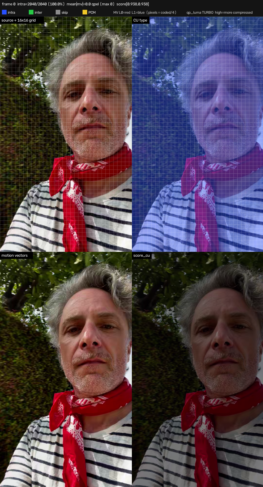
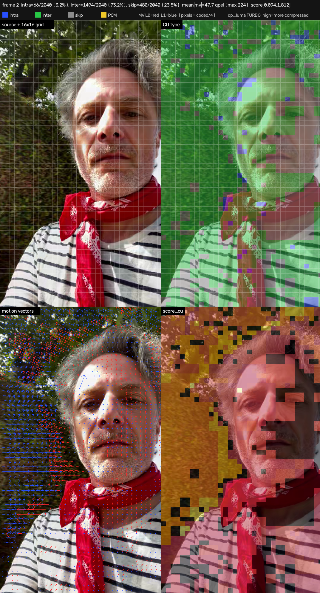
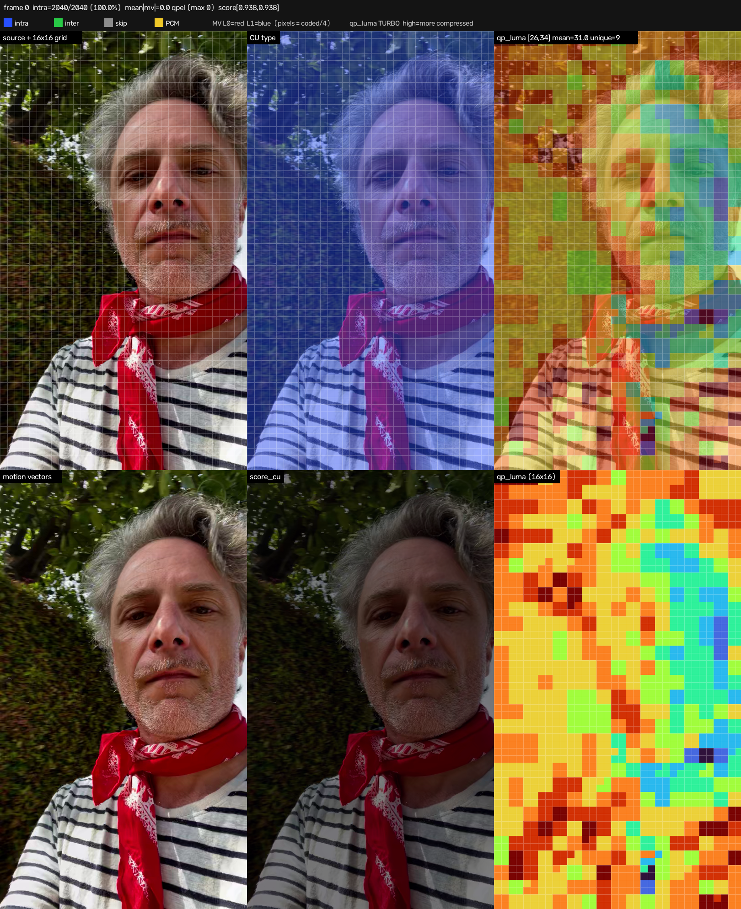

# AutoGaze: Internal Testing

[](https://autogaze.github.io/)

AutoGaze (Autoregressive Gazing) is a model that automatically selects informative patches and removes redundant ones in any video, such that downstream ViTs/MLLMs can process fewer patches without information loss. This makes downstream ViTs/MLLMs much more scalable to high-resolution, high-FPS, long-form videos (e.g., 4K-resolution 1K-frame videos).

## NVILA-HD-Video @ nvf=16: Fine-Grained Latency Breakdown

Dense vs AutoGaze (chunked-batched, `MAX_BATCH_SIZE_AUTOGAZE=64`), 25 EgoSchema questions.

### Results (n=25, avg/question)


#### Detailed Table:

| | dense | autogaze (batched) |
|---|---:|---:|
| accuracy | 52.0% (13/25) | 68.0% (17/25) |
| avg tokens to LLM | 24,145 | 1,535 |
| avg e2e | 4,915 ms | 8,257 ms |
| decode (CPU) | 31 | 105 |
| image_preproc (CPU) | 867 | 867 |
| autogaze_ops (CPU) | 0 | 818 |
| autogaze_model (GPU) | 0 | 6,007 |
| other (CPU) | 69 | 5 |
| vit (GPU) | 2,893 | 188 |
| llm_prefill (GPU) | 872 | 114 |
| llm_decode (GPU) | 126 | 108 |

### Findings

1. **Dense preproc is CPU-bound; AutoGaze preproc is GPU-bound** — its gazing model (6,007ms) is
   ~77% of its 7.8s preproc.
2. **AutoGaze's win is on the LLM side, not preproc.** ~16x fewer tokens cuts `vit` 15x and
   `prefill` 7x, but its 6s gazing-model cost outweighs those savings — AutoGaze is currently
   *slower* end-to-end (8.3s vs 4.9s).

## Full-dataset results: EgoSchema (n=500) + VideoMME (n=1395)

Same methodology as above, scaled up to the full EgoSchema subset and the locally-available
VideoMME subset (1395 of 2700 questions).

| | EgoSchema dense | EgoSchema autogaze | VideoMME dense | VideoMME autogaze |
|---|---:|---:|---:|---:|
| accuracy | 54.4% (272/500) | 60.4% (302/500) | 54.9% (766/1395) | 55.6% (775/1395) |
| avg tokens to LLM | 23,784 | 1,598 | 28,318 | 1,526 |
| avg e2e | 5,350 ms | 8,328 ms | 5,666 ms | 9,572 ms |
| decode (CPU) | 67 | 110 | 52 | 54 |
| image_preproc (CPU) | 884 | 868 | 934 | 1,059 |
| autogaze_ops (CPU) | 9 | 822 | 4 | 1,060 |
| autogaze_model (GPU) | 0 | 6,114 | 0 | 7,041 |
| other (CPU) | 95 | 5 | 99 | 5 |
| vit (GPU) | 3,325 | 166 | 3,472 | 146 |
| llm_prefill (GPU) | 823 | 98 | 973 | 77 |
| llm_decode (GPU) | 92 | 94 | 78 | 86 |


### NVDEC vs Software Codec Implementations
The NVDEC hardware implementation provides a significant speed-up over a naive software decoder, but requires an NVDEC core, driver version >= 610 and CUDA >=13.1 (https://docs.nvidia.com/video-technologies/video-codec-sdk/13.1/read-me/index.html#:~:text=or%20higher%20Toolkit-,Linux,CUDA%2013.1%20or%20higher%20Toolkit,-Jetson%20Linux). 
Profiling on a 1080x1920, 130-frame sequence to compare runtimes of the two codec implementations. Note, CreateDemuxer, CreateDecoder, and teardown are largely fixed runtimes regardless of the number of frames decoded, so while NVDEC is asymptotically >100x faster, the actual speedup depends on number of frames decoded.

#### "codec" (original implementation)
```
phase                       mean_ms   std_ms  min_ms    max_ms    n
--------------------------  --------  ------  --------  --------  -
decode+dump_stats           13457.75  18.80   13441.91  13489.33  5
grep+parse CSV              5545.86   95.01   5454.78   5668.78   5
score_cu + paint maps       1198.81   13.41   1180.09   1215.58   5
TOTAL                       20227.67  109.75  20103.42  20363.25  5
Speed: 155.6 ms/frame 
```

#### "codec_nvdec" (NVDEC-based implementation)
```
phase                    mean_ms  std_ms  min_ms  max_ms  n
-----------------------  -------  ------  ------  ------  -
CreateDemuxer            2.81     0.59    2.26    3.66    5
CreateDecoder            57.24    2.24    55.94   61.18   5
decode+parse_stats       158.42   12.45   151.03  180.08  5
teardown                 58.38    2.79    56.19   63.05   5
NVDEC dump grids         276.90   15.31   265.70  302.53  5
score_cu_grid            12.22    0.21    11.99   12.53   5
TOTAL                    289.12   15.52   277.69  315.06  5

Speed: 2.224 ms/frame = (1.313 ms/frame + 118.43 ms )
```

However, NVDEC does not return the original partition structure, rather a grid of regularly-spaced 16x16pxl patches. This aligns more closely with AutoGaze, simplifying the required post-processing, but removes partition information especially useful for the first I-frame, where there are no motion vectors.





Depending on the encoding configuration used (which we cannot impact with bitstreams from the wild), the dumped `qp_luma` could be used to derive confidence scores for these I-frames.



### Installation

```bash
conda create -n autogaze python=3.11 && conda activate autogaze
conda install -c nvidia cuda-toolkit=12.8   # match your installed torch's CUDA version if different
pip install uv
uv pip install -e .
```

If that fails on your CUDA/architecture, install torch/transformers for your platform manually
first, then `pip install -e . --no-deps`. On aarch64 (GB200), `transformers~=4.51` in
`pyproject.toml` is too old — use `transformers==5.14.1` instead.

### Data

```
data/egoschema/
  subset.json          # {q_uid, question, "option 0".."option 4", answer, ...}
  videos/<q_uid>.mp4
```

```bash
huggingface-cli download VLM2Vec/egoschema-rawvideo --repo-type dataset \
  --local-dir data/egoschema/videos
```

`subset.json`/`questions.json` follow the official EgoSchema question format
(github.com/egoschema/EgoSchema) — source them from there.

### Models

No manual download step — `nvidia/NVILA-8B-HD-Video` (~16.2GB) and `nvidia/AutoGaze` (tiny) are
neither gated nor private, so `trust_remote_code=True` auto-downloads both from Hugging Face Hub
on first run and caches them (`HF_HOME`, or `~/.cache/huggingface` by default). 

### How to Run
```bash
CUDA_VISIBLE_DEVICES=1 REPO_DIR=$(pwd) NVILA_DEVICE=cuda:0 \
  PYTORCH_CUDA_ALLOC_CONF=expandable_segments:True \
  FIXED_NUM_VIDEO_FRAMES=16 N_SAMPLES=25 MAX_BATCH_SIZE_AUTOGAZE=64 MODES=autogaze,dense \
  DATASET=egoschema \
  python3 scripts/nvila_hd_accuracy_breakdown_test.py
python3 scripts/plot_latency_breakdown.py
```

`DATASET` selects `egoschema` or `video_mme`. `N_SAMPLES` also accepts `full` to use every
available item — this is what was used for the [full-dataset results](#full-dataset-results-egoschema-n500--videomme-n1395)
above:

```bash
conda activate auto_gaze
cd /home/thannan/scratch/AutoGaze

# EgoSchema (500 questions, the full answerable subset)
CUDA_VISIBLE_DEVICES=<gpu> REPO_DIR=$(pwd) NVILA_DEVICE=cuda:0 \
  PYTORCH_CUDA_ALLOC_CONF=expandable_segments:True \
  FIXED_NUM_VIDEO_FRAMES=16 N_SAMPLES=full MAX_BATCH_SIZE_AUTOGAZE=64 \
  MODES=autogaze,dense DATASET=egoschema \
  python3 scripts/nvila_hd_accuracy_breakdown_test.py

# VideoMME (1395 questions -- only ones whose video is downloaded locally, see Data above)
CUDA_VISIBLE_DEVICES=<gpu> REPO_DIR=$(pwd) NVILA_DEVICE=cuda:0 \
  PYTORCH_CUDA_ALLOC_CONF=expandable_segments:True \
  FIXED_NUM_VIDEO_FRAMES=16 N_SAMPLES=full MAX_BATCH_SIZE_AUTOGAZE=64 \
  MODES=autogaze,dense DATASET=video_mme \
  python3 scripts/nvila_hd_accuracy_breakdown_test.py
```


`scripts/nvila_hd_accuracy_breakdown_test.py` monkey-patches the vendored (`trust_remote_code`)
`NVILAProcessor` at runtime (no source edits) to split `preproc_ms` into `decode`, `image_preproc`,
`autogaze_ops`, `autogaze_model` (GPU), and `other`, and `llm_ms` into `prefill`/`decode`. It also
short-circuits the AutoGaze CPU transform whenever a processor's config skips AutoGaze for both
tiles and thumbnails (dense mode) — safe because that output is never read in the skip path.

### Raw outputs

- `benchmark_results/nvila_hd_accuracy_breakdown_{autogaze,dense}_egoschema_nvf16.jsonl` — per-question (this README's n=25 numbers)
- `benchmark_results/nvila_hd_accuracy_breakdown_summary_egoschema_nvf16.json` — averaged summary

## Idea: Student Distillation for Faster AutoGaze

The latency breakdown above shows AutoGaze's gazing model is the dominant cost, driven by its
autoregressive, frame-by-frame decision process. One proposal to close that gap: distill a
"student" model that consumes all frames in a single forward pass, trained to match the
autoregressive model's per-frame decisions, trading the 16 sequential steps for 1.


