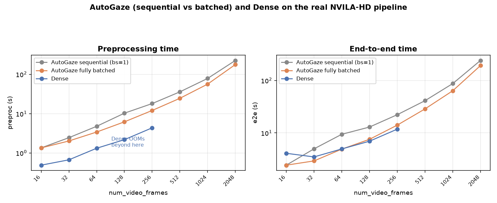
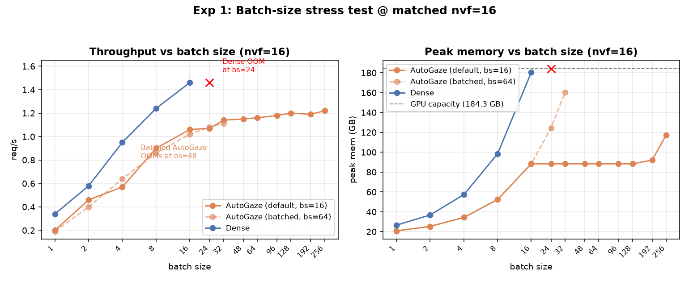
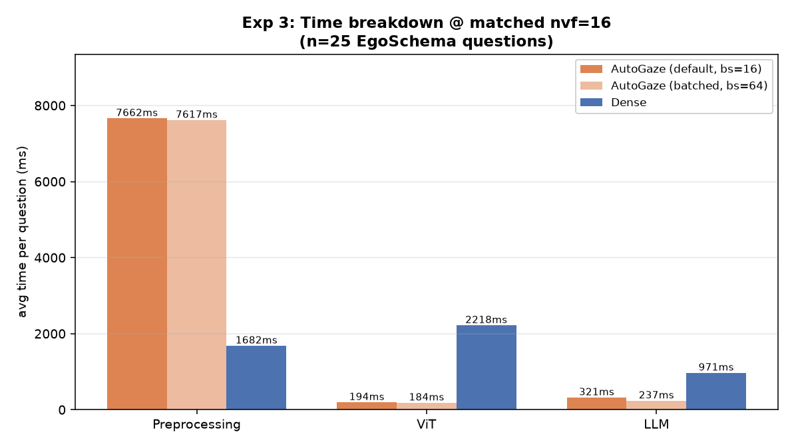
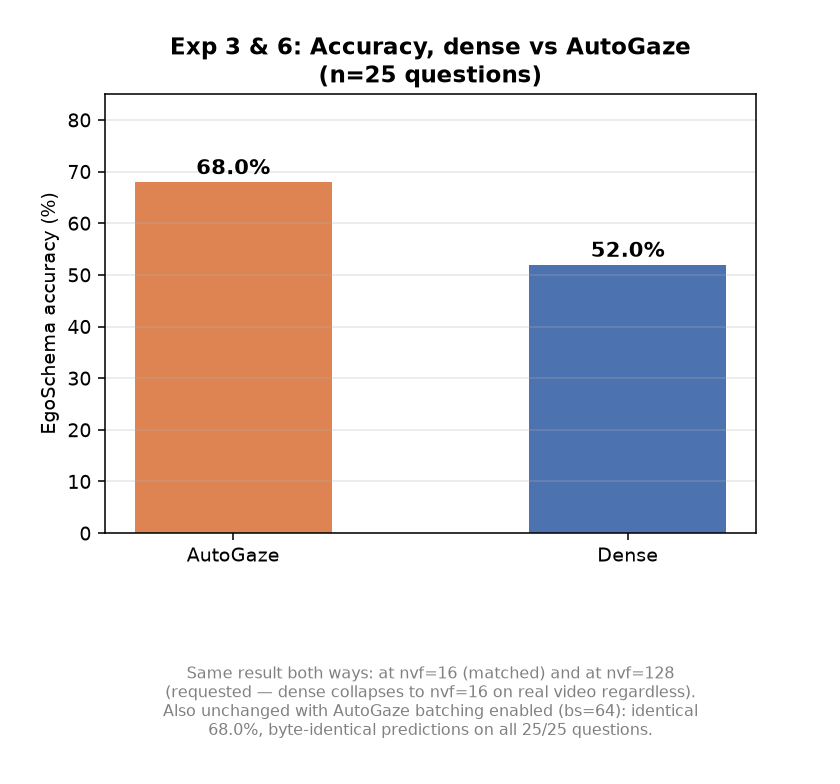
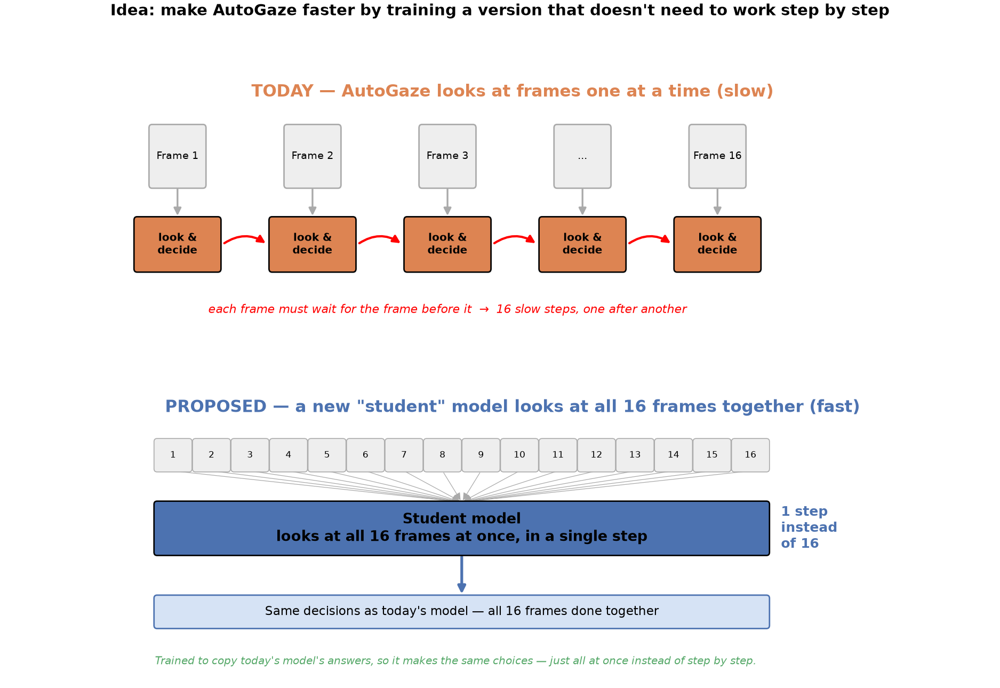

# NVILA-HD-Video: Dense vs AutoGaze Summary

---
## 1. Video frame scaling (Square Video Frames)


```bash
# Frame-budget sweep: NVF_CONFIGS = num_video_frames values swept (x-axis of the plot above);
# BATCH_SIZE_CONFIGS = max_batch_size_autogaze values tried at each nvf (sequential vs batched).
CUDA_VISIBLE_DEVICES=<gpu> REPO_DIR=$(pwd) NVILA_DEVICE=cuda:0 \
  PYTORCH_CUDA_ALLOC_CONF=expandable_segments:True \
  NVF_CONFIGS=16,32,64,128,256,512,1024,2048 BATCH_SIZE_CONFIGS=1,2,4,8,16,32,64,128 \
  python3 scripts/nvila_hd_autogaze_batchsize_sweep.py
# dense reference points (nvf=16/32/64): scripts/nvila_hd_dense_low_nvf.py
# dense reference points (nvf=128/256):  scripts/nvila_hd_length_sweep.py
```

<!-- ---
## 2. Batch-size scaling @ matched nvf=16


```bash
NUM_VIDEO_FRAMES=16 CUDA_VISIBLE_DEVICES=<gpu> REPO_DIR=$(pwd) NVILA_DEVICE=cuda:0 \
  python3 scripts/nvila_hd_stress_test.py
# batched variant: add MAX_BATCH_SIZE_AUTOGAZE=64 (env var, defaults to 16)
``` -->

---
## 2. Time breakdown: EgoSchema


**Why EgoSchema is much slower for AutoGaze than the square test video in Section 1**: it's a
tiling difference, not a bug. NVILA uses InternVL-style dynamic tiling — a video's tile count is
chosen by matching its aspect ratio to the closest `(i, j)` grid shape, `num_tiles = i*j`. The
square synthetic video (448×448, ratio 1.0) matches `(1,1)` exactly → 1 tile. Real EgoSchema videos
have non-square aspect ratios (e.g. 448×336 → ratio 1.33, 448×252 → ratio 1.78), so they need
`(4,3)`-style grids or wider → 12-15 tiles even at nvf=16 (sometimes up to 45 for extreme aspect
ratios). AutoGaze's gazing model runs once per tile, so preprocessing cost scales directly with
tile count (~0.5-0.6s/tile) — 12-15x more tiles means roughly 12-15x more preprocessing time,
which is exactly the ~1.3s (1 tile) vs ~7.7s (12-15 tiles) gap seen between Sections 1 and 3.

```bash
CUDA_VISIBLE_DEVICES=<gpu> REPO_DIR=$(pwd) NVILA_DEVICE=cuda:0 \
  FIXED_NUM_VIDEO_FRAMES=16 N_SAMPLES=25 python3 scripts/nvila_hd_accuracy_test.py
# batched variant: add MAX_BATCH_SIZE_AUTOGAZE=64 (env var, defaults to 16)
```

---
## 3. Accuracy: dense vs AutoGaze


*(same run as Section 3 — `nvila_hd_accuracy_test.py` reports accuracy and the preproc/ViT/LLM
breakdown together in one pass.)*

---
## 4. Proposed (not implemented): distill AutoGaze into a non-autoregressive student
